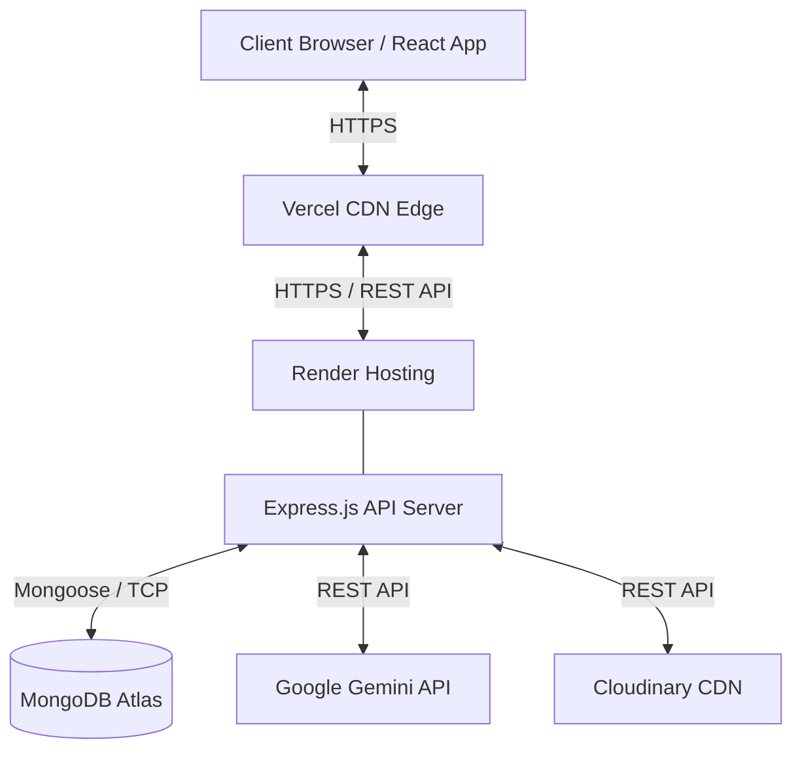
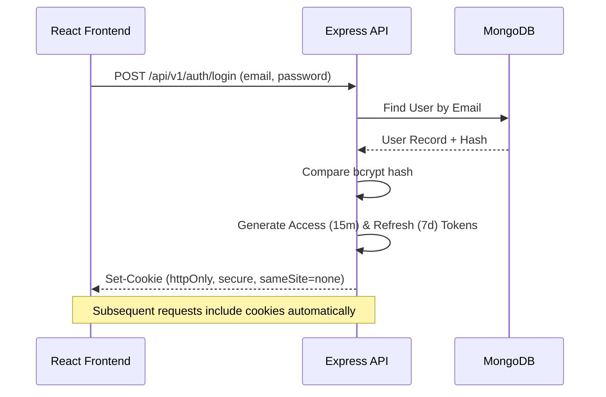
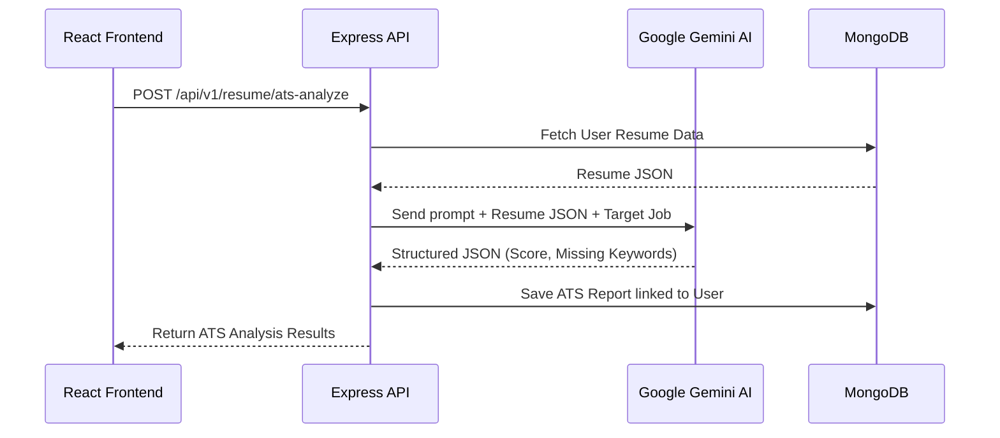
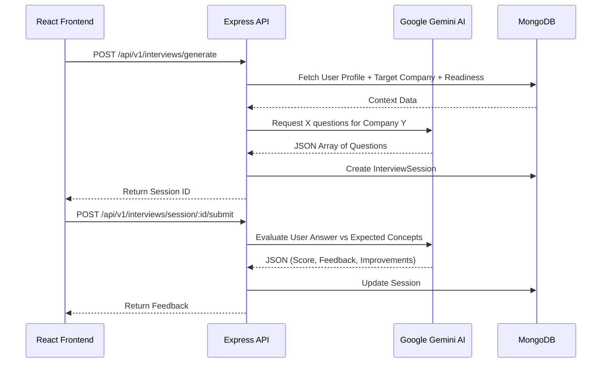
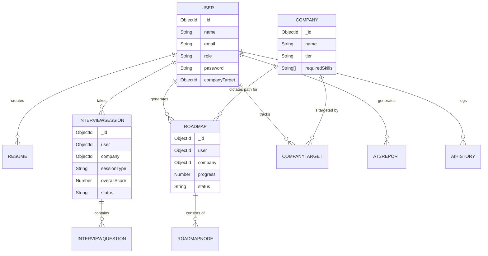

# ECE Career Compass - System Architecture & Documentation

## 1. Technology Stack

### Frontend (Client-side)
* **Framework:** React 18
* **Build Tool:** Vite
* **State Management:** Zustand
* **Routing:** React Router DOM v6
* **Styling:** Tailwind CSS + Radix UI Primitives
* **Icons:** Lucide React
* **Forms & Validation:** React Hook Form + Zod
* **HTTP Client:** Axios (with Interceptors for JWT Refresh)

### Backend (Server-side)
* **Runtime:** Node.js
* **Framework:** Express.js
* **Database:** MongoDB (Mongoose ODM)
* **Authentication:** JWT (JSON Web Tokens) with HTTP-only Cookies
* **AI Integration:** Google Gemini API (`@google/genai`)
* **Security:** Helmet, CORS, Express Rate Limit, Mongo Sanitize

### Infrastructure & Deployment
* **Frontend Hosting:** Vercel
* **Backend Hosting:** Render / Railway
* **Database Hosting:** MongoDB Atlas
* **Asset Storage:** Cloudinary (Profile pictures/Logos)

---

## 2. Overall System Architecture

---

## 3. Core Data Flows

### A. Authentication & Authorization Flow

### B. AI ATS Resume Analysis Flow

### C. Mock Interview Flow

---

## 4. Database Entity-Relationship (ER) Diagram

---

## 5. Deployment Architecture Security

1. **CORS (Cross-Origin Resource Sharing):** Configured on the Express backend to explicitly allow requests ONLY from the designated Vercel frontend URL.
2. **HTTP-Only Cookies:** JWT Access and Refresh tokens are sent as `httpOnly` cookies, making them inaccessible to JavaScript (mitigating XSS attacks).
3. **SameSite=None & Secure:** Because the Vercel frontend and Render backend reside on different domains, cookies are marked `SameSite=None` and `Secure=true` (requiring HTTPS).
4. **Environment Variables:** All secrets (MongoDB URI, Gemini API Key, JWT Secrets) are stored in the server runtime environment and never pushed to GitHub.

---

## 6. Viva Preparation (Questions & Answers)

### Q1. Why did you choose React + Vite instead of Create React App?
**A:** Vite uses native ES modules (ESM) which makes local development server startup nearly instantaneous regardless of project size. It uses Rollup for highly optimized, smaller production builds, whereas CRA relies on Webpack which is slower and heavier.

### Q2. How is authentication handled in this project?
**A:** Authentication is handled using JWT (JSON Web Tokens). Upon login, the Express server generates a short-lived Access Token (15m) and a long-lived Refresh Token (7d). Instead of sending these in the JSON body, the server attaches them as `httpOnly`, `Secure` cookies. The frontend Axios client uses an interceptor to catch `401 Unauthorized` errors, automatically hitting the `/refresh` endpoint to get a new access token seamlessly.

### Q3. Why use `httpOnly` cookies instead of `localStorage` for JWT?
**A:** `localStorage` is accessible via JavaScript, making the application vulnerable to XSS (Cross-Site Scripting) attacks where a malicious script could steal the token. `httpOnly` cookies cannot be read by JS, preventing token theft.

### Q4. How does the AI (Gemini) integration work?
**A:** We use the official `@google/genai` SDK on the backend. When a user requests an action (e.g., Resume Review, Mock Interview), the Express controller gathers the user's data from MongoDB, crafts a highly specific prompt instructing Gemini to act as a recruiter/interviewer, and strictly enforces the response format to be `application/json`. The backend parses this JSON and stores the result in MongoDB. The API key is securely stored on the backend, never exposed to the frontend.

### Q5. What is CORS and how did you configure it?
**A:** CORS (Cross-Origin Resource Sharing) is a browser security feature that restricts web pages from making requests to a different domain than the one that served the web page. We configured the Express `cors` middleware to explicitly allow the `CLIENT_URL` (our Vercel domain) and enabled `credentials: true` so the browser allows cookies to be sent cross-origin.

### Q6. How do you prevent users from accessing other users' data?
**A:** We enforce Strict IDOR (Insecure Direct Object Reference) protection. Every protected route passes through an `authenticate` middleware that verifies the JWT and attaches the user ID (`req.user._id`). In the controllers, database queries always filter by `{ user: req.user._id }`. We never trust a `userId` passed from the frontend request body or params.

### Q7. How does the Readiness Score algorithm work?
**A:** The Readiness Score is a weighted aggregation of multiple modules. It calculates a normalized score out of 100 based on: Aptitude test results, Core ECE MCQs, Coding submission acceptance rate, Resume ATS score, Roadmap progress, and Mock Interview performance. These weights are dynamically calculated on the backend to provide a real-time, holistic view of the student's placement readiness.
